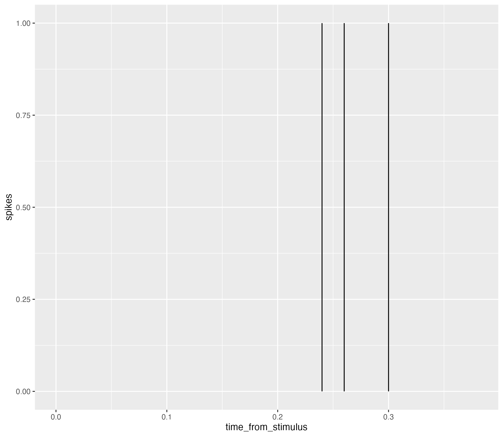
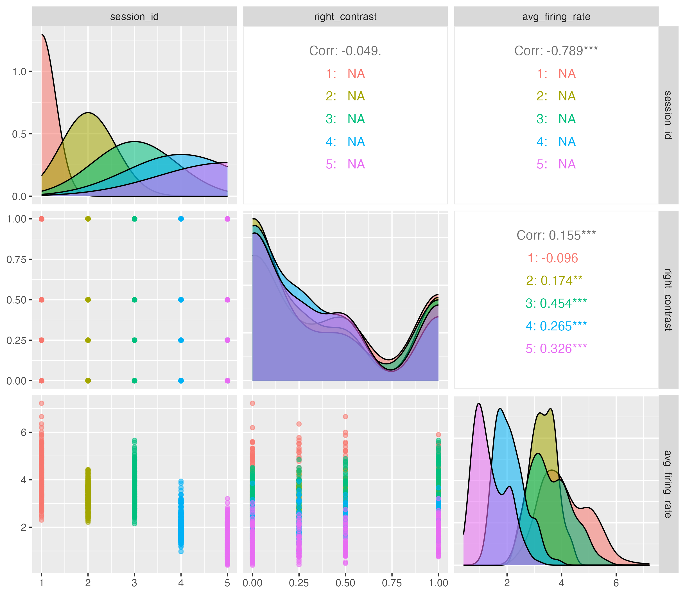
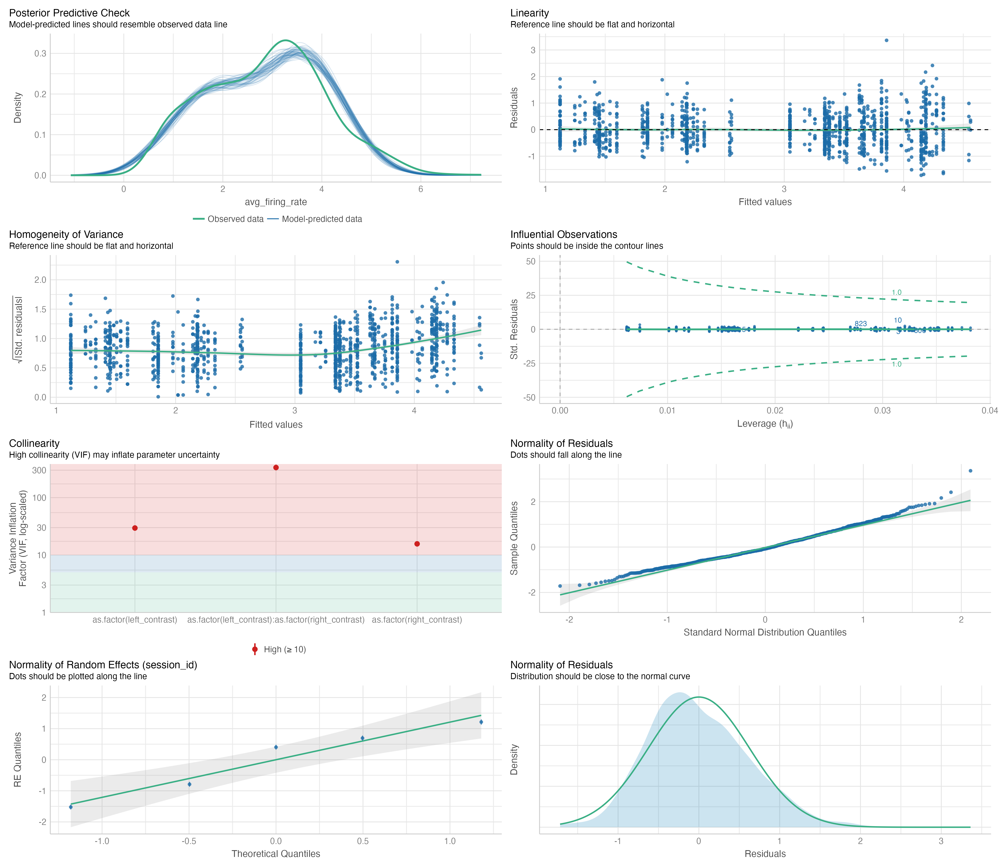

# Abstract

This project studied two questions related to how visual cortex neurons of mice respond to stimuli using data from experiments conducted by Steinmetz et al. (2019). The first question was whether neurons in the visual cortex respond differently to stimuli presented on the left and right sides, which was addressed using a mixed-effect ANOVA model and hypothesis tests. The second question was how to predict the outcome of each trial using neural activities and stimuli, which was addressed using a logistic regression model. The analysis focused on data from sessions with VIS-related regions, and the results showed a statistically significant interaction effect between the left and right stimuli on neural responses. However, the model had issues with equal-variance-of-residuals and normality assumptions, and multicollinearity could be investigated further. The logistic regression model had high sensitivity but requires further testing and model diagnostics.

# Introduction

In this project, 2 questions regarding how visual cortex neurons of mice respond to stimuli were studied on the dataset from the experiments conducted by Steinmetz et al. (2019). The first question of interest is how do neurons in the visual cortex respond to the stimuli presented on the left and right. The second question is how to predict the outcome of each trial using the neural activities and stimuli. The first question is equivalent to testing if the left and right stimuli have additive effects on the neural responses (i.e., whether the interaction effect exists). A mixed-effect anova model and corresponding hypothesis test were fitted and conducted to address the question. The second question is of a minor interest and a simple logistic regression model was conveyed briefly, trained to make predictions on the binary binary feedback outcome.

# Background

In the study conducted by Steinmetz et al. (2019), experiments were performed on a total of 10 mice over 39 sessions, each composed of several hundred trials. Among the 39 sessions, 3 sessions (526 trials in total) were from the mouse named Cori and 4 sessions (904 trials in total) were from Forssmann. The analysis done in this project focuses specifically on the data from the 3 sessions on Cori and 2 sessions on Forssmann. From supplementary Table 2 of Steinmetz et al. (2019), all 3 sessions for Cori contained VIS-related regions. Only session from 2017-11-01 and 2017-11-02 contain recordings from VIS for Forssmann. In each trial, 2 visual stimuli with 4 levels of contrasts were present on the left and right side of the mouse. The mouse is required to turn the wheel to the direction of higher contrast. If the mouse has turned the wheel in the correct direction, a positive feedback is given to it.

**Variables:** There are 7 variables for the data collected for 1 trial in each session: (i) mouse name, (ii) date of experiment, (iii) feedback on the success and failure of mouse wheel turning, (iv) left stimulus contrast, (v) right stimulus contrast, (vi) timestamp of the collection of neuron responses (vii) spike trains which is a collection of hundreds of neurons response.


# Descriptive Analysis

**Unique Data Structure:** In session 1 of Cori, 214 trials of experiment were performed. In each trial, information of the firing conditions of 178 neurons were collected from the probe randomly inserted into different regions of the mouse's brain. For each neuron, 39 timestamps were recorded. At each timestamp, the corresponding fire/no-fire status of the neuron was also recorded. A fire corresponds to the number 1 and vice versa in record. With the information, we can generate a spike raster plot (Figure 1) for neuron 1 in trial 1 from time 65.27941 second (the onset of the stimulus) to time 65.65941 second (0.38s or roughly 0.4s post-onset).



**Outcome Variable Definition:** The mean firing rate, which is calculated as, for each trial, the average number of spikes per second across all neurons within a given 0.4 seconds time interval is used as the outcome variable. This variable is chosen because it is a single numerical value is much easier to deal with than the original matrices of neuron responses dispersed over all timestamps. Emperically, using the mean is a good respresentation to start an analysis with.

**Summary Statistics:** From the summary statistics table, it can be found that a contrast level of 0 is most frequently presented in both the left side screen and the right side screen. From the distribution of the feedback type variable, we can see that mice were able to turn the wheel in the correct direction 2 times more often than the turning into the wrong direction. This could be a result of having contrast level of 0 present more often. As when one screen does not have a visual stimulus present and the other screen has a relatively high contrast, then it is more easier to identify which screen has a stronger contrast, resulting in the correct-direction turning of wheels of the mouse. The average firing rate has a mean and a mode of 3, indicating that most sessions have an average firing rate of 3 which is a representation for the neuron performance.

```{r, echo=F, message=F, warning=F}
library(dplyr)
library(summarytools)
library(ggplot2)

# Create the data frame for fitting the model
session = list()
for (i in 1:5) {
    session[[i]] = readRDS(paste('data/session', i, '.rds', sep = ''))
}

t = 0.4
data = data.frame()

for (session_id in 1:5) {
    n_trials = length(session[[session_id]]$spks)
    left_contrast = session[[session_id]]$contrast_left
    right_contrast = session[[session_id]]$contrast_right
    feedback_type = session[[session_id]]$feedback_type
    avg_firing_rate = sapply(session[[session_id]]$spks, 
                             FUN=function(spks_df) {
                                 n_neurons = dim(spks_df)[1]
                                 sum(spks_df)/n_neurons/t # average firing rate
                             })
    data = rbind(data,
                 cbind(rep(session_id, n_trials), 
                       left_contrast, 
                       right_contrast, 
                       feedback_type,
                       avg_firing_rate))
}

names(data) = c("session_id", "left_contrast", "right_contrast", "feedback_type", "avg_firing_rate")
data = as.data.frame(apply(data, MARGIN = 2, as.numeric))


print(summarytools::dfSummary(data), method = "render")
```

**Findings:** From Figure 2, we find that session 1 and 3 has higher average firing rate while session 2, 4, and 5 are lower. This is interesting since the sessions are performed in different dates. This could be a result of passive learning so that later sessions require fewer neurons to respond and to perform the task. 



    
# Inferential Analysis

This section is mainly to answer the first question, how do neurons in the visual cortex respond to the stimuli presented on the left and right. This question can be further reduced to test if the left and right stimuli have additive effects on the neural responses (i.e., whether the interaction effect exists). A mixed effect ANOVA model with 2 fixed-effect factors, left contrast and right contrast, 1 interaction effect factor between the 2 fixed-effect factors, and 1 random-effect factor, the session id, is considered. The mouse name, is not included as a random-effect factor in purpose. Since the data was collected from only 2 mice, there are simply too few mouse samples to consider the random effects from different mice. The null hypothesis that the two fixed-effect factors have no interaction effect is proposed and a Likelihood Ratio Test is performed to answer the question.

**Model:** The proposed model is $Y_{ijkl} = \mu_{...} + \alpha_i + \beta_j + (\alpha \beta)_{ij} + \gamma_k + \epsilon_{ijkl}$, where

- $i=1,...,4$, $j=1,...,4$, $k=1,...,5$, $l=1,...,n_{ijk}$
- $\{\alpha_i\}$ represents the fixed effect of the left contrast with 4 levels: 0 (i=1), 0.25 (i=2), 0.5 (i=3), 1 (i=4)
- $\{\beta_j\}$ represents the fixed effect of the right contrast with 4 levels: 0 (j=1), 0.25 (j=2), 0.5 (j=3), 1 (j=4)
- $\{(\alpha \beta)_{ij}\}$ represents the interaction effect of the left contrast and the right contrast with 16 levels/combinations of left contrast and right contrast pairs
- $\{\gamma_k\}$ represents the random effect of the session id with 5 different sessions {1,...,5} encoded by k={1,...,5}
- $\{Y_{ijkl}\}$ represents the average firing rate of the trial l in session k with left contrast $\alpha_i$ and right contrast $\beta_j$
- $\{\epsilon_{ijkl}\}$ represents the random error in the average firing rate of the trial l in session k with left contrast $\alpha_i$, right contrast $\beta_j$

**Model Constraints:** (i) $\sum_i \alpha_i = 0$, (ii) $\sum_j \beta_j = 0$, (iii) $\sum_i (\alpha \beta)_{ij} = 0$ for all j, (iv) $\sum_j (\alpha \beta)_{ij} = 0$ for all i

**Model Assumptions:** (i) $\{\gamma_k\}$ are i.i.d. $N(0, \sigma^2_\gamma)$, (ii) $\{\epsilon_{ijkl}\}$ are i.i.d. $N(0, \sigma^2)$, (iii) $\{\gamma_k\}$ and $\{\epsilon_{ijkl}\}$ are mutually independent

**Hypothesis Testing:** At the significance level of 0.05, to test $H_0: (\alpha \beta)_{ij} = 0$ for all $i,j$ V.S. $H_a: (\alpha \beta)_{ij}$ are not all zero, a Likelihood Ratio Test is conducted to compare the full model specified in the Model subsection and the reduced model with the interaction-effect factor removed. The p value from the anova table is 0.04112 which is smaller than 0.05. Therefore, the null hypothesis is rejected. It can be concluded that the interaction effect is statistically significant. Therefore, the left and right stimuli do not have additive effects on the neural responses as there is a statistically significant interaction effect between the left contrast and right contrast on the neural responses.

# Model Diagnostics

To make sure that the afore designed mixed effect model is correct and suitable, model diagnostics are conducted to check for outliers and multicollinearity. The linearity, homoscedasticity and normality assumptions on the main-effect and interaction-effect factors and the residuals are validated supplied with potential remedies if necessary.

**Linearity:** The Linearity plot in Figure 3 validates that there is a linear relationship between the left contrast, right contrast, their interaction effect and the outcome, average firing rate which represents the neuron responses.

**Homoscedasticity:** The Homogeneity of Variance plot shows that the variance of the residuals are not equal which violates the equal variance assumption of the error terms. A potential remedy for this is to use weighted least squares and weight the error terms or to perform a rank test.

**Outliers:** There seems to be a few outliers floating on the top area on the Linearity plot. Inspecting further on the Influential Observations plot, all outliers are not influential. Therefore, there is no need to remove the outliers to refit the model. 



**Multicollinearity:** Due to the existence of the multiples factors generated from the interaction effect between left contrast and right contrast, the VIF values calculated are inflated as shown in the red region in Figure 3. The VIFs of the main effects, left contrast and right contrast, from the reduced model with the interaction factor removed are 1.15 (very close to 1) each, depicting low correlation. One potential remedy to reduce multicollinearity is to substitute the interaction effect factor by another artificial factor, contrast difference, which is a variable introduced by Steinmetz et al. (2019) taking the value of right contrast less left contrast. For example, when right contrast is 0.75 and left contrast is 0.5, then the contrast difference will be 0.75-0.5=0.25.

**Normality:** From the Normality of Residuals plot in Figure 3, it shows that the distribution of residuals are right skewed comparing to the standard normal distribution. Thus, the normality assumption on the residuals is violated. The Normality of Random Effects (session_id) plot suggests that the normality assumption of the random-effect factor, session id, holds. However, this check might not be meaningful as there are only 5 sessions which are simply too few to check for their distribution. 

**Inclusion of the Random Effect:** The variance of the random effect, session id, is 1.2667; the variance of residuals 0.3995; resulting in a total variance of 1.6662. ICC=1.2667/1.6662=0.7602329 means that around 76% of the total variance is contributed by the variability between different sessions. Although there are only 5 sessions, the session id factor seems to be an important factor that we should not ignore its random effect. A more rigorous LRT test is conducted to compare the proposed full model in Inferential Analysis and the reduced model without the random effect, session id. Under the null hypothesis at the level 0.05 that the random effect is not significant, a p value of < 2.2e-16 is obtained. Thus, the null hypothesis is rejected and the random effects from sessions are needed to be accounted for in the full model at the significance level of 0.05. 

**Outcome Statistics:** Other than using the average firing rate as the statistics representing the outcome, there are definitely other options as well. One possible way is to divide the neurons into clusters first and then use the average firing rate in each of the clusters as the outcome. In such way, the main and random effects could be examined in a much more detailed manner for each cluster and it's clearer to see how different clusters of neurons could respond differently according to left contrast and right contrast. 

# Predictive Modelling

To answer the second question, how to predict the outcome of each trial using the neural activities and stimuli, a logistic regression model is proposed to predict the outcome of each trial. 

**Model:** $logit(P(\text{feedback type} = 1)) = \beta_0 + \beta_1 X_{\text{left contrast}} + \beta_2 X_{\text{right contrast}} + \beta_3 X_{\text{left contrast : right contrast}} + \beta_4 X_{\text{average firing rate}}$ where

- $X_{\text{left contrast}}$ is a categorical variable representing the 4 levels of left contrast
- $X_{\text{right contrast}}$ is a categorical variable representing the 4 levels of right contrast
- $X_{\text{left contrast : right contrast}}$ is a categorical variable representing the interaction effect
- $X_{\text{average firing rate}}$ is a continuous variable presenting the average firing rate of the corresponding trial

**Model Performance:** The data from 5 sessions is split into a test set containing data from the first 100 trials in session 1. The rest of the data is used as the training set. The model is trained on the training set and tested on the test set. Upon prediction of the feedback type outcome for each trial in the test set, a sensitivity of 72/(72+2)=0.972973 and a specificity of 2/(2+24)=0.076923 are obtained. As sensitivity and specificity are inversely related, the high sensitivity suggests that the model is able to predict the trials in which the mouse has wheeled in the correct direction correctly mostly but suffers from the trouble of making many false positive predictions.

# Discussion

In the first part of the report, the fitted mixed-effect anova model and the corresponding hypothesis tests showed that the left and right stimuli do not have additive effects on the neural responses as there is a statistically significant interaction effect between the left contrast and right contrast on the neural responses. However, there are some remedies required after doing model diagnostics. The equal-variance-of-residuals assumption is violated. A potential remedy for this is to use weighted least squares and weight the error terms or to perform a rank test. Multicollinearity is an interesting direction for further investigation. The model now has too many factors mostly created by the interaction effects. Maybe the incorporation of a new variable represents the difference in contrast could mitigate this issue. The normality assumption for the residuals is also violated and a remedy for this issue could be another interesting direction of research.

In the last part, a logistic regression model is fitted to predict the outcome of each trial using the neural activities and stimuli. The model results in a high sensitivity of 0.972973 on the test set. The logistic regression model might look like a good model for the prediction problem, but further testings with a larger test set and model diagnostics could be conducted to make sure it is robust and truely sensitive.

# Acknowledgement {.unnumbered}
This production of the test methods are implemented with help from talking with classmates and reading classmates' Piazza posts.


# Reference

Steinmetz, N.A., Zatka-Haas, P., Carandini, M. et al. Distributed coding of choice, action and engagement across the mouse brain. Nature 576, 266--273 (2019). <https://doi.org/10.1038/s41586-019-1787-x>

# Session info {.unnumbered}


```{r}
sessionInfo()
```